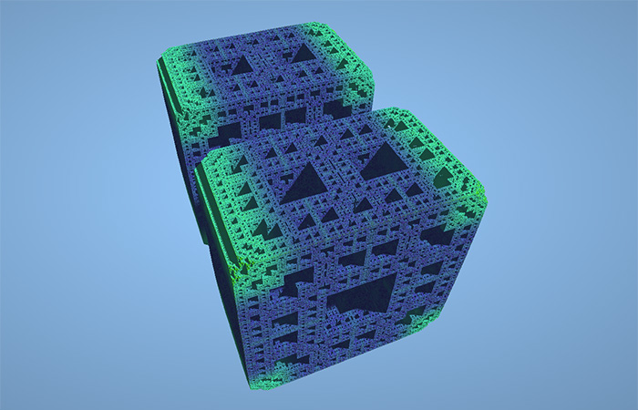

This is 3D fractal generator based on [Marble Marcher Game](https://github.com/HackerPoet/MarbleMarcher). It's written in pure JavaScript + WebGL. Vertex + fragment sheader is ported from Marble Marcher.

## License

3D fractal generator is open-sourced software licensed under the [MIT license](http://opensource.org/licenses/MIT).